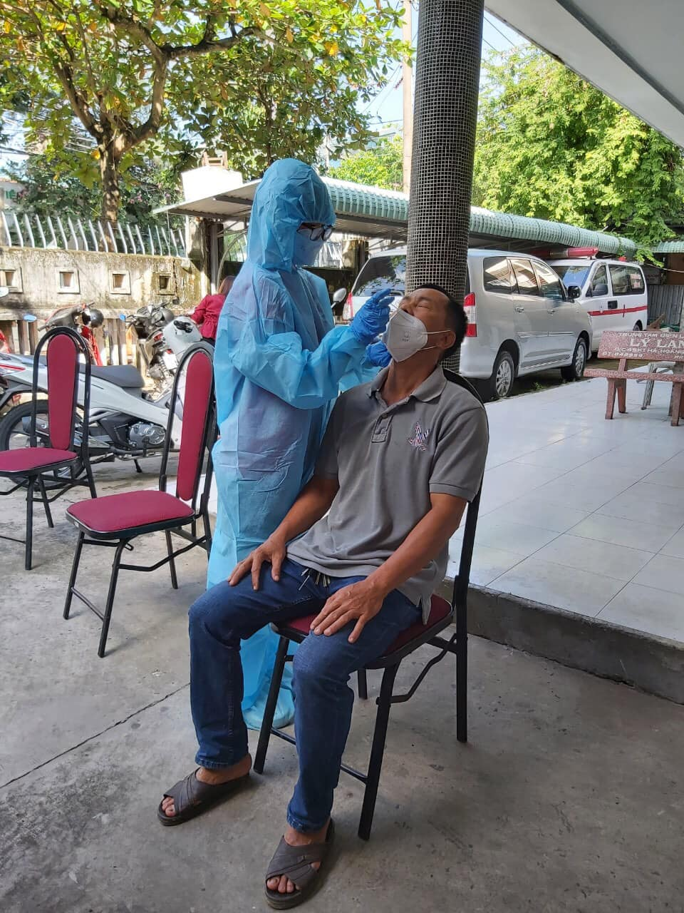
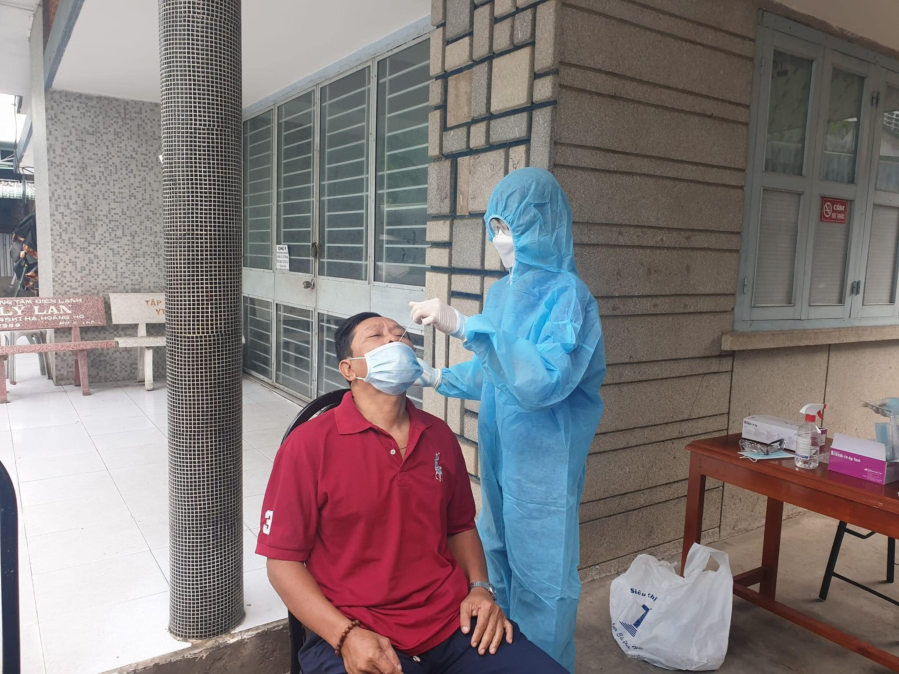
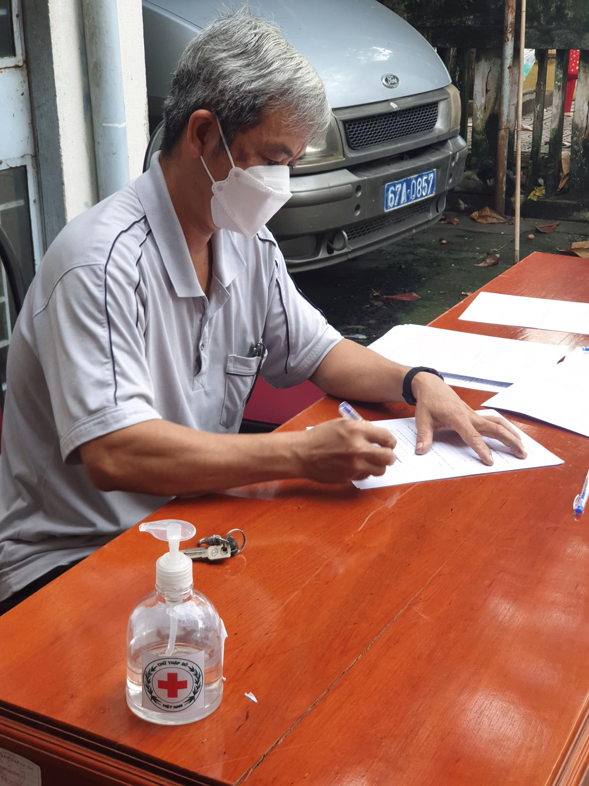
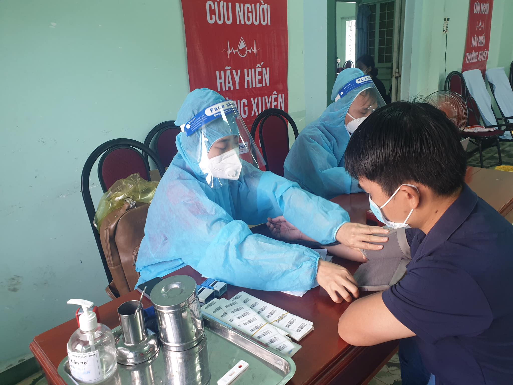
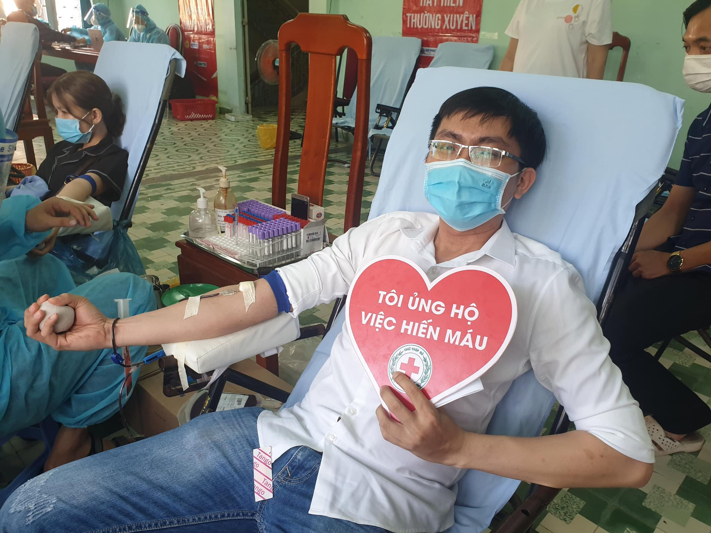
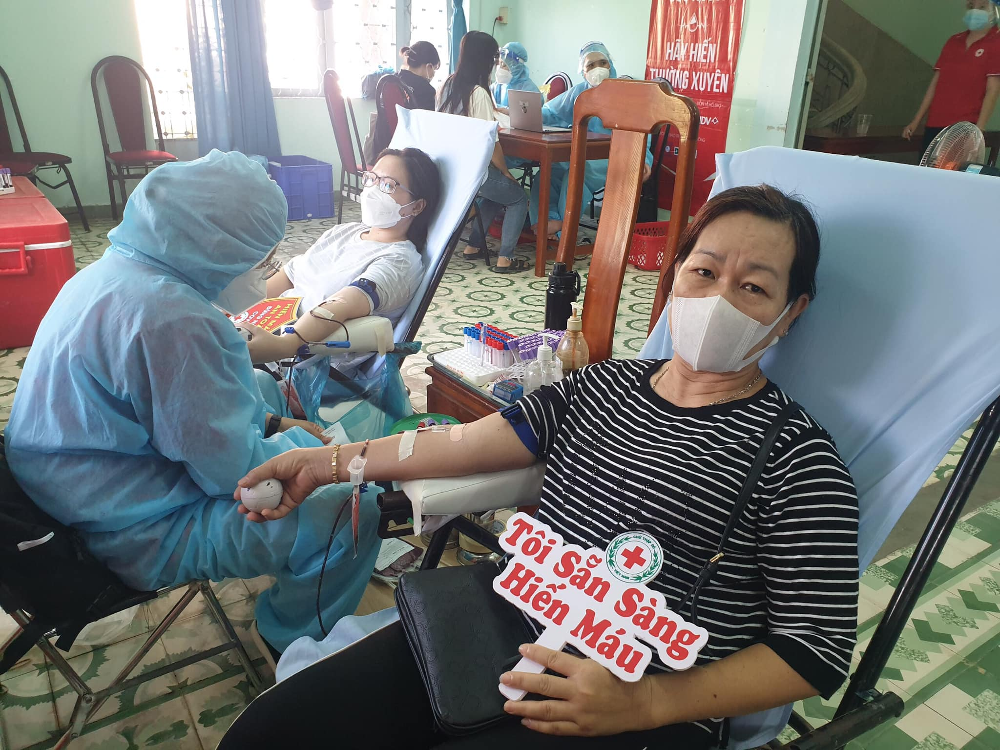
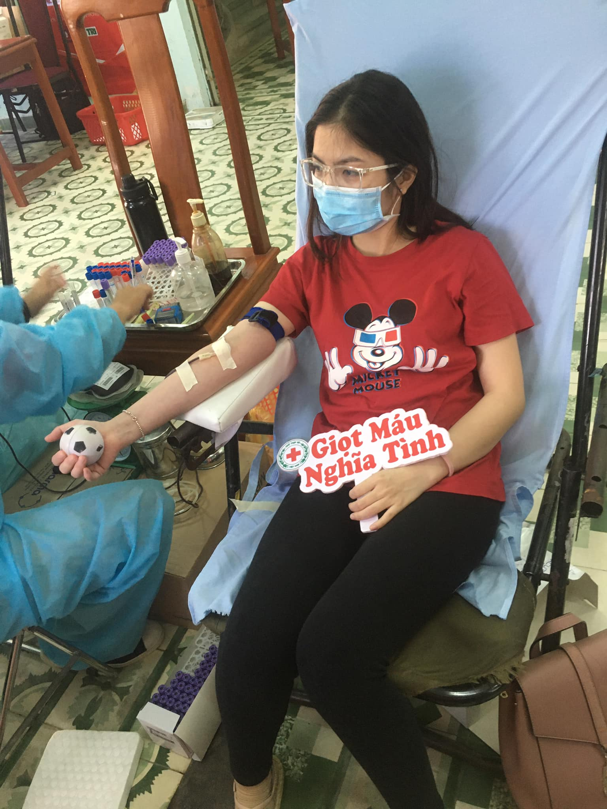

Tiếp tục thực hiện hoạt động nhân đạo nhằm duy trì nguồn quỹ máu trao tặng phục vụ hoạt động cứu người, sáng ngày 13/11/2021 tại trụ sở Hội Chữ thập đỏ An Giang số 10-11 Lê Lợi, P. Mỹ Bình, TP. Long Xuyên tiếp tục thực hiện hoạt động hiến máu nhân đạo.
Mặc dù dịch bệnh diễn biến phức tạp nhưng hoạt động vẫn thu hút nhiều tấm lòng thiện nguyện vì cộng đồng, kết quả đã tiếp nhận được 65 đơn vị máu trao tặng.
Ban tổ chức và người tham dự luôn tuân thủ tuyệt đối những nguyên tắc về phòng chống dịch, mỗi cá nhân đều được test nhanh Covid-19 trước khi tham gia và luôn ý thức thực hiện nguyên tắc 5k theo quy định.
Hội Chữ thập đỏ tỉnh An Giang tri ân đến những tấm lòng nhân ái đã quan tâm và đồng hành cũng Hội để thực hiện thành công chuỗi hoạt động nhân đạo ý nghĩa này.

