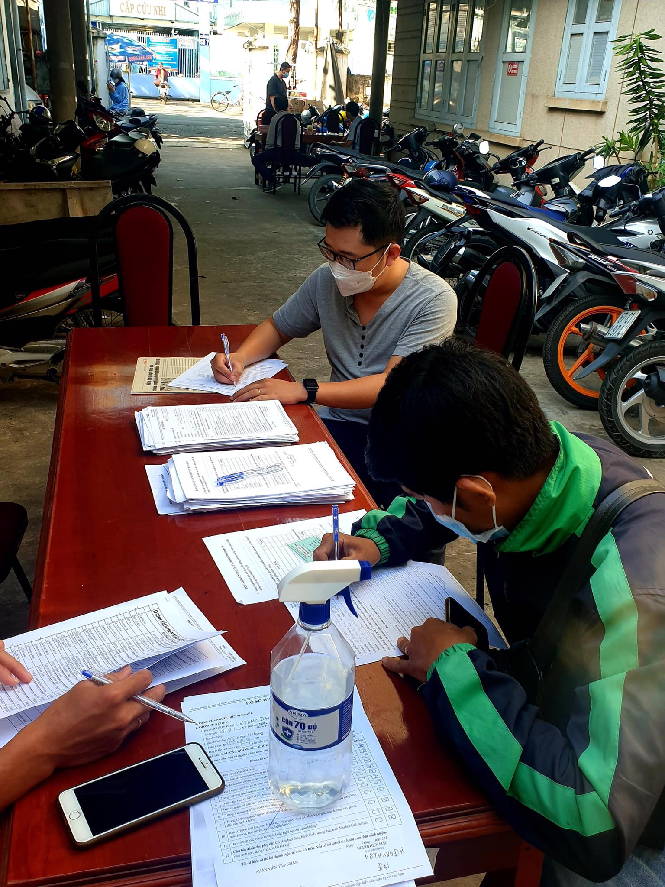
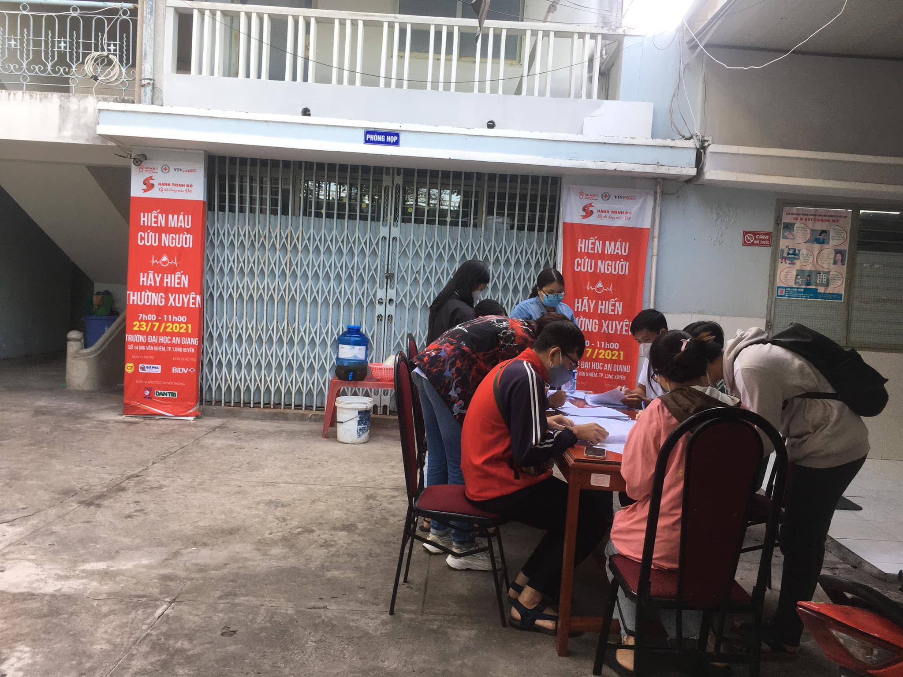
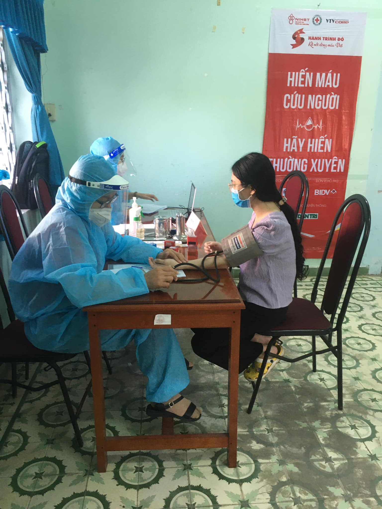
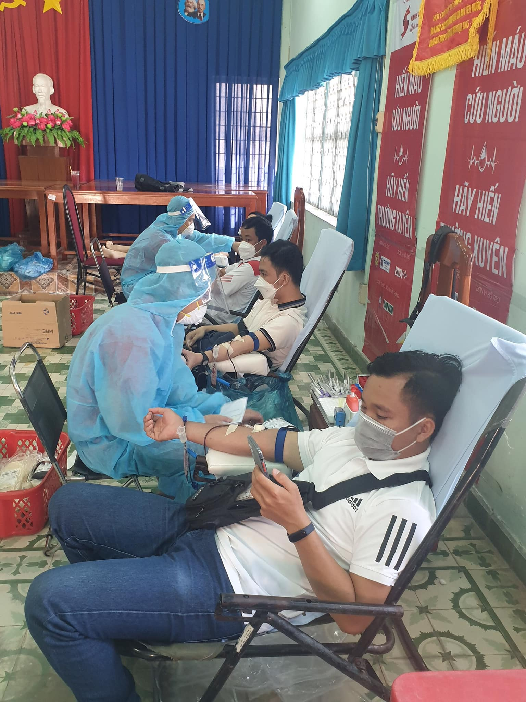
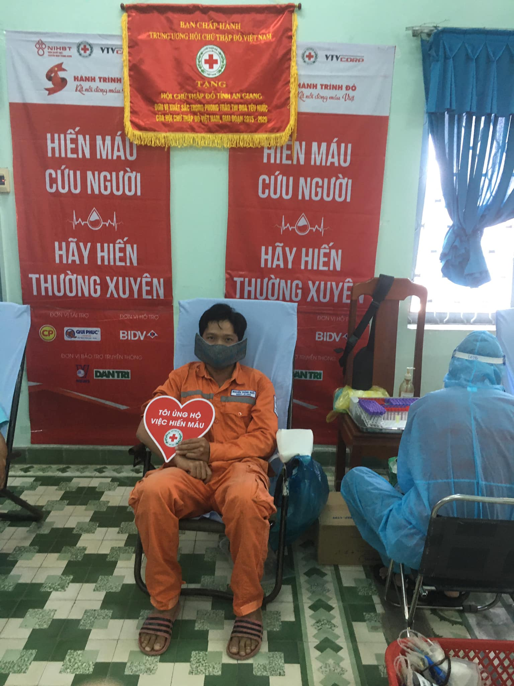
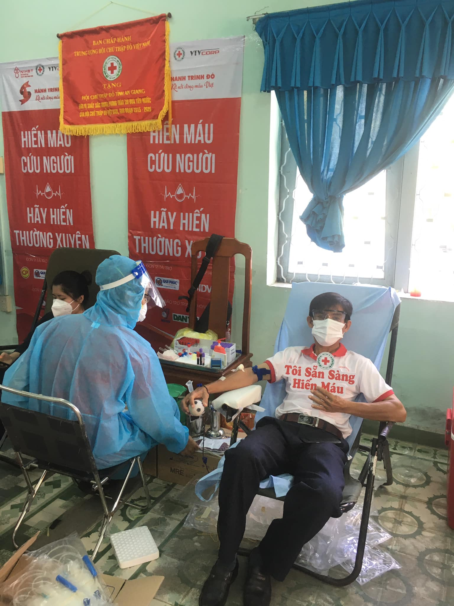
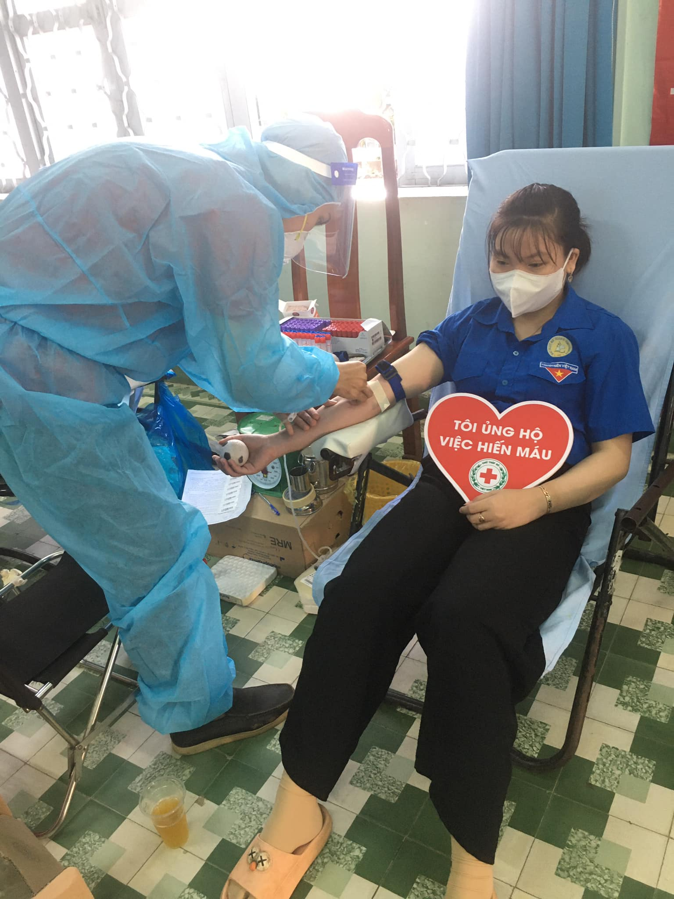
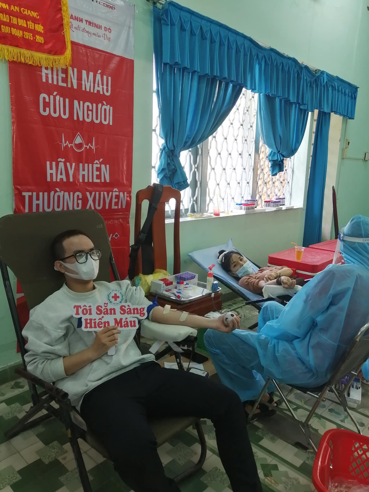
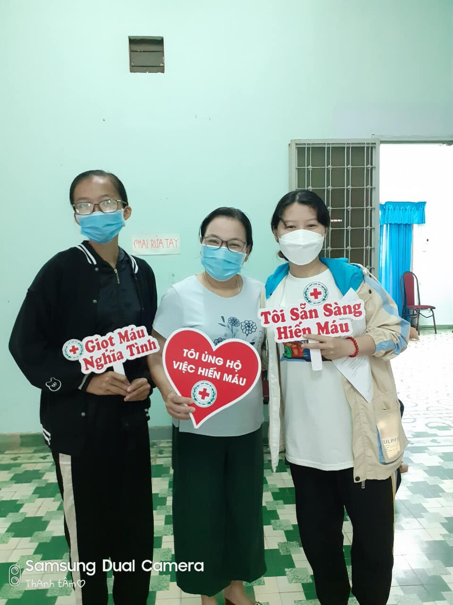
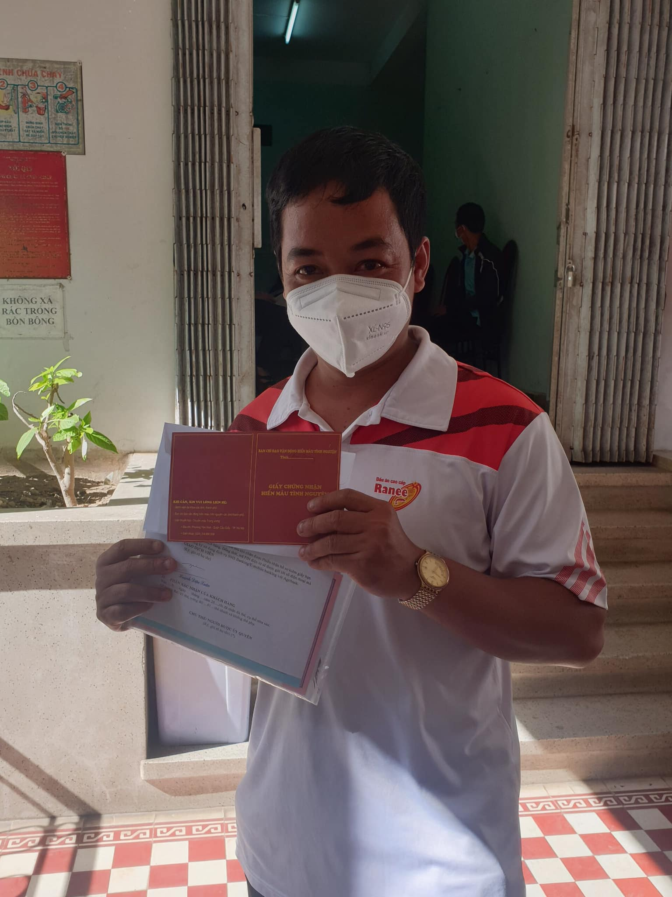

Sáng 18/12/2021 Hội Chữ thập đỏ tỉnh tiếp tục tổ chức thực hiện hoạt động hiến máu nhằm duy trì nguồn quỹ máu trao tặng phục vụ hoạt động cứu người tại trụ sở Hội Chữ thập đỏ An Giang, số 10-11 Lê Lợi, P. Mỹ Bình, TP. Long Xuyên.
Hoạt động thu hút được sự quan tâm và tham gia của nhiều người dân. Kết quả đã tiếp nhận được 95 đơn vị máu trao tặng. Ban tổ chức và người tham dự luôn tuân thủ tuyệt đối những nguyên tắc về phòng chống dịch.
Tiếp nối sau đó, ngày 21/12 và 23/12 hoạt động sẽ diễn ra lần lượt tại chùa PGHH và UBND xã Bình Thạnh Đông, huyện Phú Tân.
Hội Chữ thập đỏ tỉnh An Giang tri ân đến những tấm lòng nhân ái đã quan tâm và đồng hành cùng Hội để thực hiện thành công chuỗi hoạt động nhân đạo ý nghĩa này.

