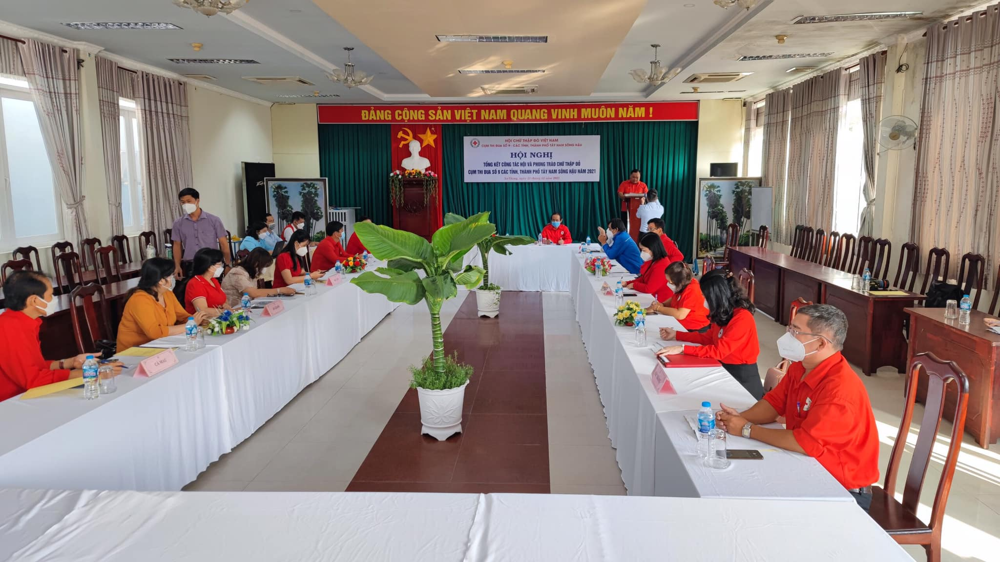
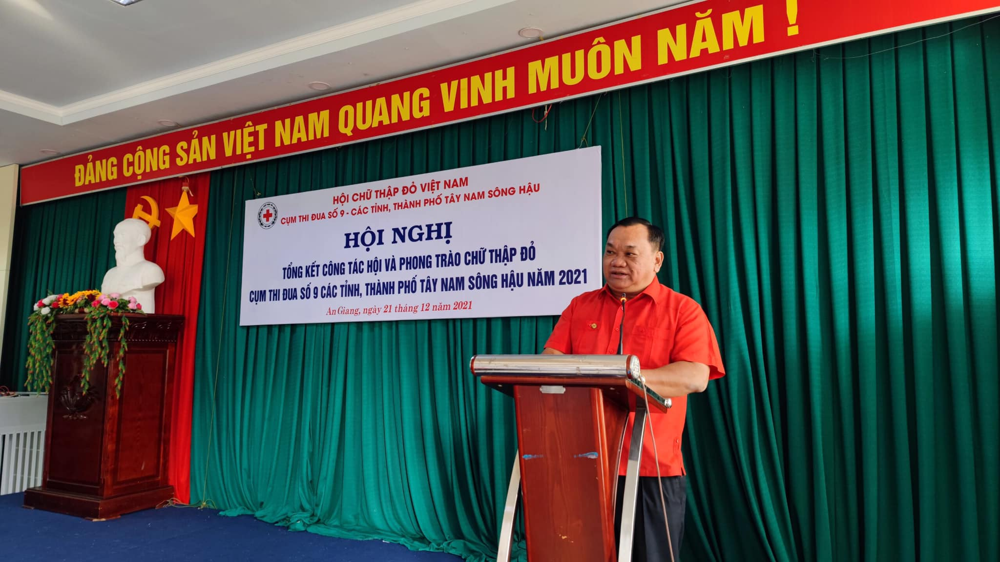
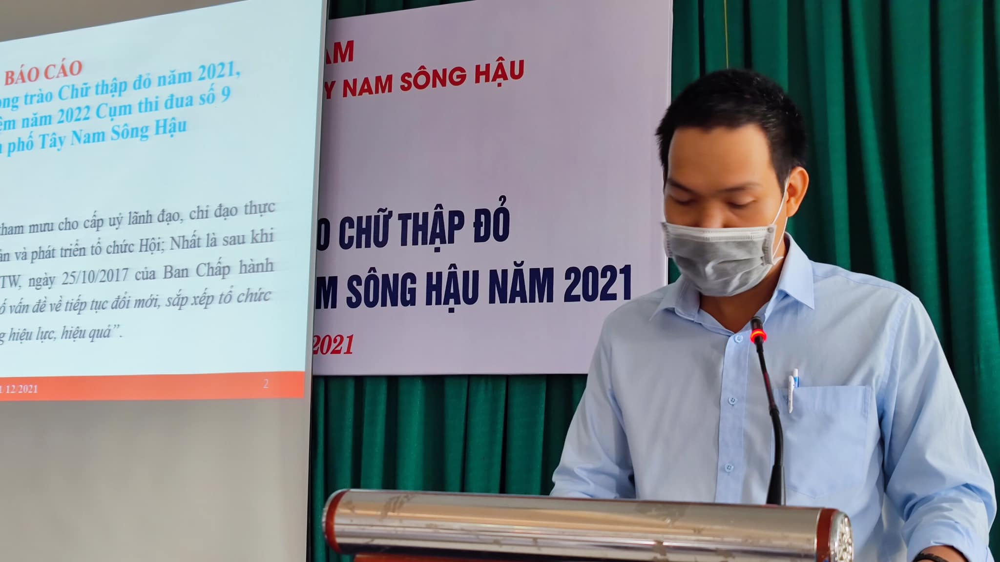
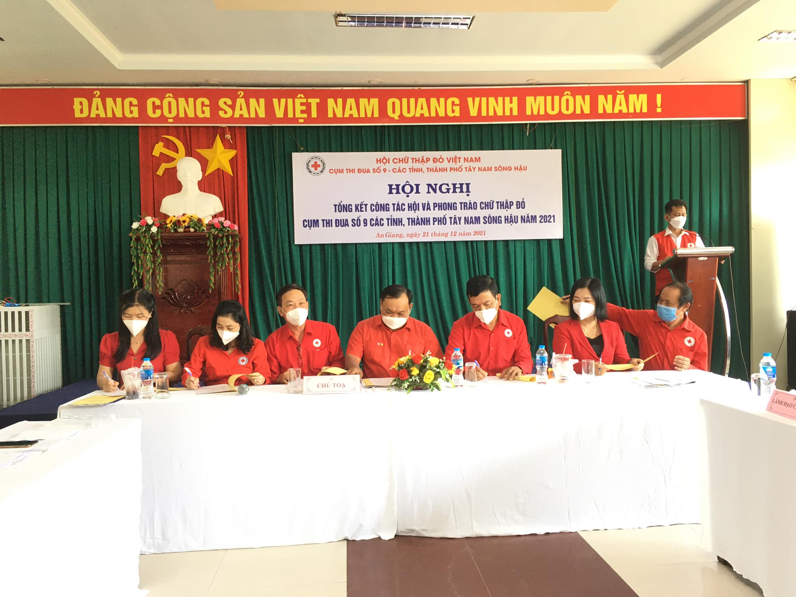
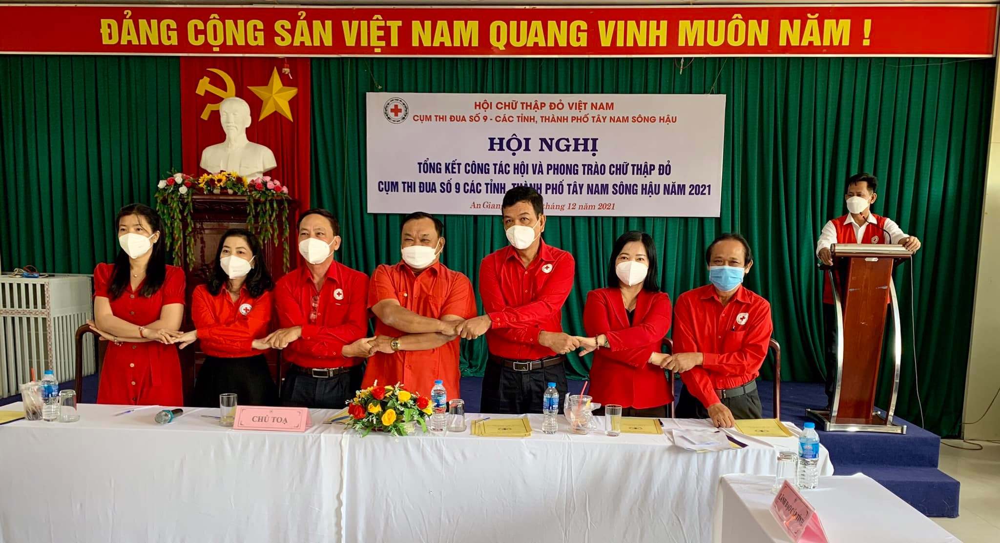
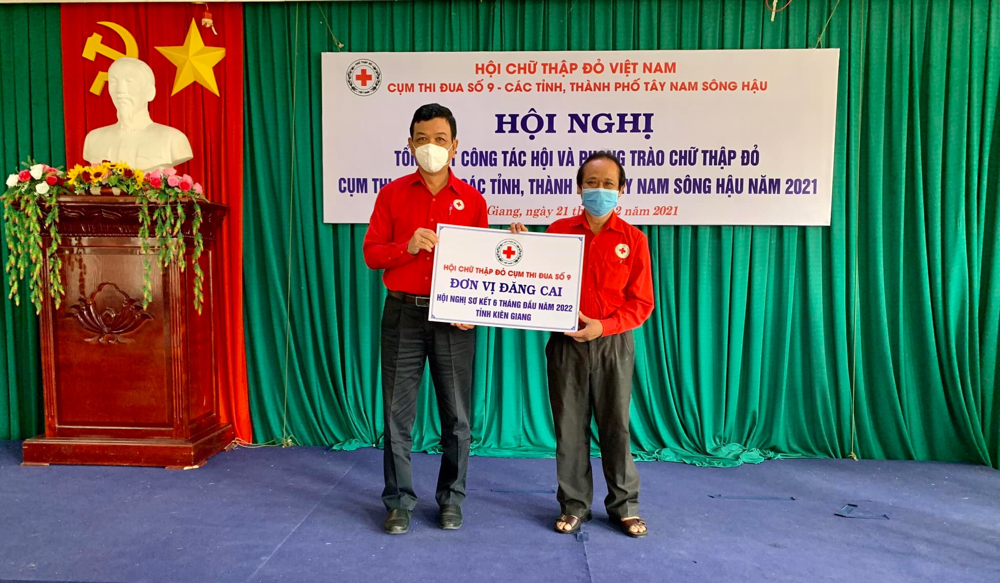

Sáng ngày 21/12/2021, Hội Chữ thập đỏ tỉnh An Giang tổ chức Hội nghị tổng kết công tác Hội và phong trào Chữ thập đỏ Cụm thi đua số 9, các tỉnh, thành phố Tây Nam Sông Hậu năm 2021.
Tham dự Hội nghị có đ/c Lê Khánh Hội – Phó Ban dân vận tỉnh ủy, ông Huỳnh Thanh Ngọc – Chủ tịch Hội Chữ thập đỏ tỉnh An Giang, ông Trần Quốc – Chủ tịch Hội Chữ thập đỏ tỉnh Cà Mau, Cụm trưởng Cụm thi đua số 9 và đại diện Lãnh đạo Hội Chữ thập đỏ các tỉnh, thành phố: Hậu Giang, Bạc Liêu, Sóc Trăng, Cần Thơ và Kiên Giang.

Tại Hội nghị, đã thông qua báo cáo tóm tắt tổng kết công tác Hội và phong trào Chữ thập đỏ cụm thi đua số 9 năm 2021, với tổng giá trị hoạt động của cụm trong năm là hơn 833 tỷ đồng, tiếp sau hội nghị tiến hành thảo luận, đồng thời ký kết giao ước thi đua năm 2022 và bàn giao nhiệm vụ đăng cai Hội nghị giao ban 6 tháng đầu năm 2022 cho Hội Chữ thập đỏ tỉnh Kiên Giang đảm trách.
Phát biểu tại Hội nghị, Ông Trần Quốc – Cụm trưởng cụm thi đua đã giải trình các ý kiến từ phía đại biểu, đồng thời tuyên dương các đơn vị đạt thành tích tốt trong thực hiện công tác Hội và phong trào Chữ thập đỏ 2021, hy vọng các tỉnh, thành tiếp tục phát huy để đạt nhiều thắng lợi trong năm 2022.

