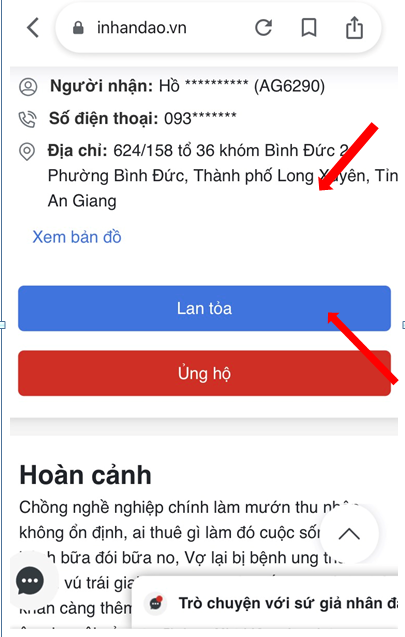
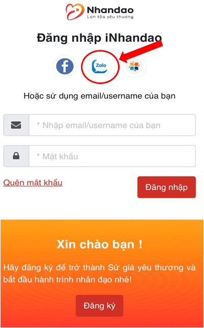

  Xung quanh chúng ta còn rất nhiều hoàn cảnh khó khăn: từ những người thiếu thốn từng bữa ăn cái mặc hàng ngày; những người mang trong mình căn bệnh hiểm nghèo; những cụ ông, cụ bà neo đơn ở tuổi xế chiều; những em nhỏ vì nhà quá nghèo có thể lỡ dỡ chuyện học hành, ….. Đã thế đại dịch Covid-19 kéo đến, bà con càng thêm trăm phần vất vả.
  Xuân lại sắp về, Hội rất mong nhận được sự quan tâm từ Quý Mạnh Thường Quân có thể san sẻ yêu thương đến những bà con còn khó khăn tại An Giang.
  Bạn chẳng cần đi đâu xa, chỉ cần ngồi tại nhà và truy cập:
- Bước 1: https://inhandao.vn/
- Bước 2: Tại cửa sổ tìm kiếm gõ: An Giang
- Bước 3: “Lan tỏa” để chia sẽ đến nhiều người hơn biết về hoàn cảnh đối tượng
- Bước 4: “Ủng hộ”: tiền hoặc hiện vật theo nhu cầu đối tượng trong phần thông tin. Bằng cách đăng nhập Inhandao thông qua zalo (hình bên dưới)
  
  Hội Chữ thập đỏ sẽ chuyển đến đối tượng và có cập nhật hoạt động để Quý Mạnh Thường Quân theo dõi.
  Nếu chưa thể “Ủng hộ” ngay hôm nay, xin hãy “Lan tỏa” để giúp Hội Chữ thập đỏ kêu gọi sự chung tay của cộng đồng.
  Chỉ như thế thôi, mùa xuân này những mảnh đời kém may mắn hơn chúng ta sẽ ấm áp hơn rất nhiều và cả chúng ta cũng sẽ thấy mùa xuân này thật ý nghĩa

