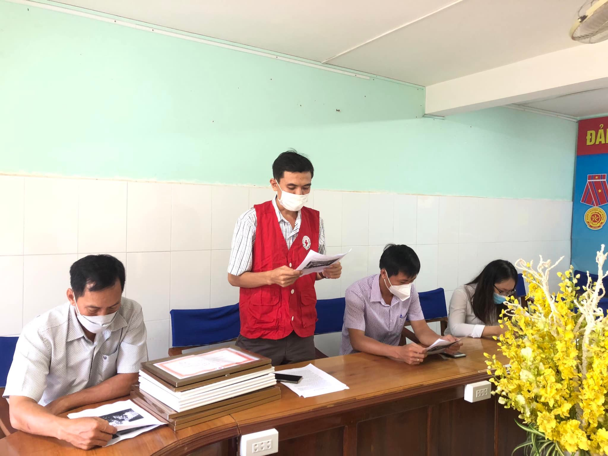

Sáng ngày 23/11/2021, Hội Chữ thập đỏ tỉnh An Giang tổ chức buổi họp mặt kỷ niệm 75 năm ngày thành lập Hội Chữ thập đỏ (23/11/1946 – 23/11/2021), Ông. Huỳnh Thanh Ngọc – Chủ tịch Hội Chữ thập đỏ tỉnh chủ trì và tập thể công chức, viên chức, người lao động thuộc Hội Chữ thập đỏ tỉnh An Giang.
Buổi họp mặt diễn ra trong không khí vui tươi, phấn khởi. Ông Huỳnh Thanh Ngọc phát biểu chúc mừng, đồng thời biểu dương tinh thần của tập thể cá nhân đã đạt nhiều thành tích xuất sắc trong phong trào, hoạt động nhân đạo.
Đặc biệt trong năm 2021, khi cả nước nói chung và tỉnh An Giang nói riêng chịu nhiều ảnh hưởng nặng nề của dịch bệnh Covid-19, Hội Chữ thập đỏ tỉnh cùng các huyện, thị, thành đã nổ lực không ngừng trong thực hiện nhiệm vụ với nhiều đóng góp tích cực cho công tác xã hội nhân đạo tỉnh nhà.
Hy vọng với tinh thần nhiệt huyết này, Hội Chữ thập đỏ tỉnh An Giang sẽ tiếp tục đạt nhiều thắng lợi trong nhiệm kỳ 2021 - 2026.

